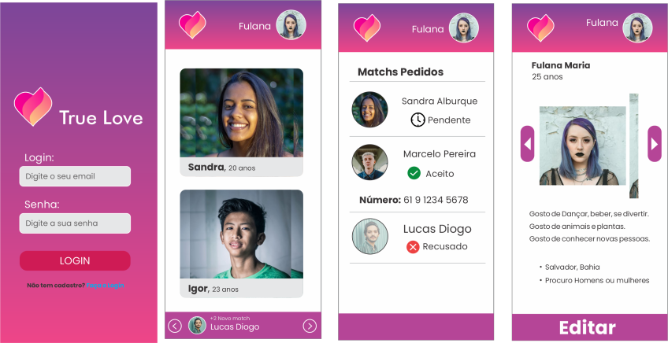

# tinder_Clone
Um clone do tinder como desafio da Comunidade CoDe!
A ideia do projeto é documentar minha forma de _codar_. Escolhi um projeto que tenha backend e frontend.

## PWA com troca de telefones de usuários por matchs.

O projeto consiste em aplicação backend com Node.js, Banco de dados com MongoDb, e frontend com React.js

as TECNOLOGIAS usadas foram:

## Backend
* bcrypt 
* cookie-parser 
* cors 
* **express**
* jsonwebtoken 
* **mongoose**
* multer 
* nodemon

## Frontend
* **React.js**
* React Router V6
* yarn(vite)
* styled-components //css escopado

--------------------------------------------------------------
Lista de tarefas:
## Backend
- [x] Criar conexão com banco de dados
- [x] Criar Arquitetura MVC
- [x] Inicializar app com index.js
- [x] Criar Rotas e Controles
- [ ] Fazer validações de usuário
- [ ] Criar sistema de autenticação por tokens
- [ ] Criar Login e verificação por token
- [ ] Criar sistema de uploads de imagens
- [ ] Criar regras de negócio da troca de telefone por Match

## Frontend
- [ ] Criar arquiteturas e rotas
- [ ] Criar hooks de formulários e autenticação
- [ ] Criar contexto de usuário
- [ ] Criar Flash Message
- [ ] Função de Login e Logout
- [ ] Criar Sistema de atualização e preview de imagem
- [ ] Dashboard de todos os usuários
- [ ] Páginas de detalhes de próprio usuário
- [ ] Páginas edição de usuário
- [ ] Páginas de detalhes de outros usuários
- [ ] Dashboard de match 
